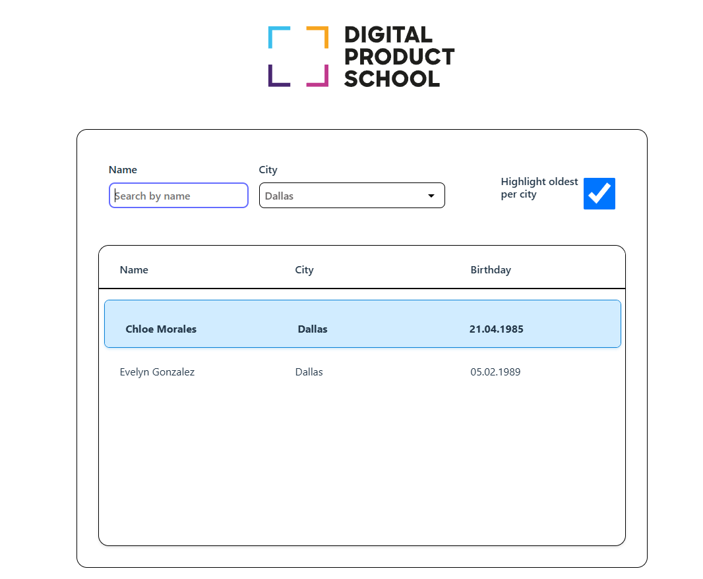

# DPS Frontend Coding Challenge

## Overview

This repository contains a very basic web application based on Typescript and React. Main application file is `App.tsx`. Node and npm are required.

## Environment Setup

Ensure you have Node.js (v14.x or later) and npm (v6.x or later) installed.  
To set up and run the application, execute the following commands:

```
npm install
npm run dev
```

The application will then be accessible at http://localhost:3000.

## Project Context

You will be enhancing a new CRM (Customer Relationship Management) software aimed at managing customer data efficiently. Your task is to develop a feature that displays a searchable list of customers.

Refer to the attached mockup image to guide your UI development 👇


## Results



\
Happy coding!
